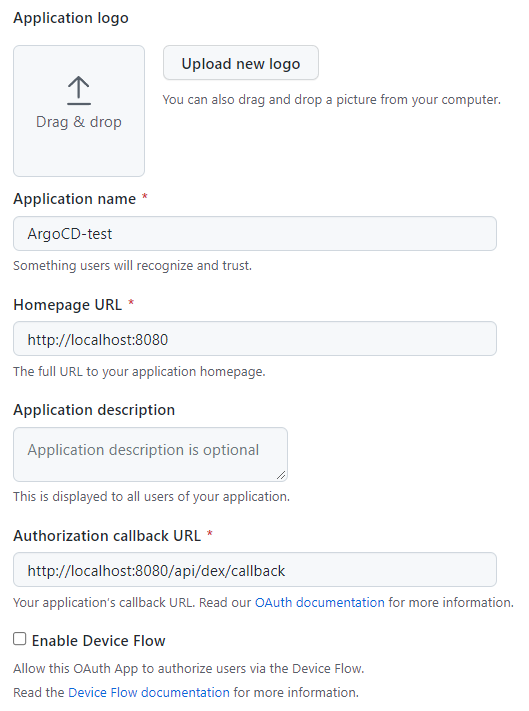

# tests/kind

## Purpose

- Test this module in a local kind cluster.
- One can use the ArgoCD dex.
- One can register a private repository.

## Access to argocd via browser

- `kubectl port-forward service/argocd-server -n argocd 8000:80`

## Gitlab OAuth Application

- Create a github sso secrets.
  - 
- Write `clientId` and `clientSecret` into `terraform.tfvars`. **DONT' push it to GitHub**.

  ```bash
  cat > terraform.tfvars <<EOF
  client_id="<clientId>"
  client_secret="<clientSecret>"
  EOF
  ```

<!-- BEGIN_TF_DOCS -->
<!-- END_TF_DOCS -->